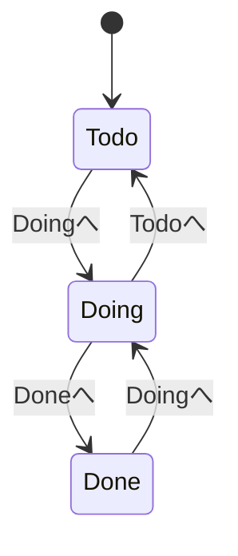
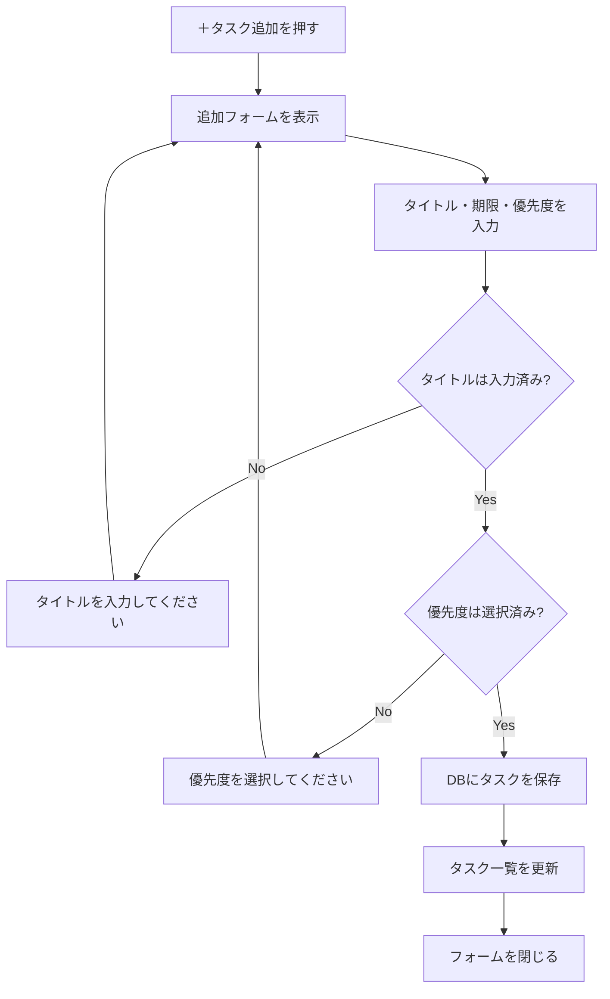
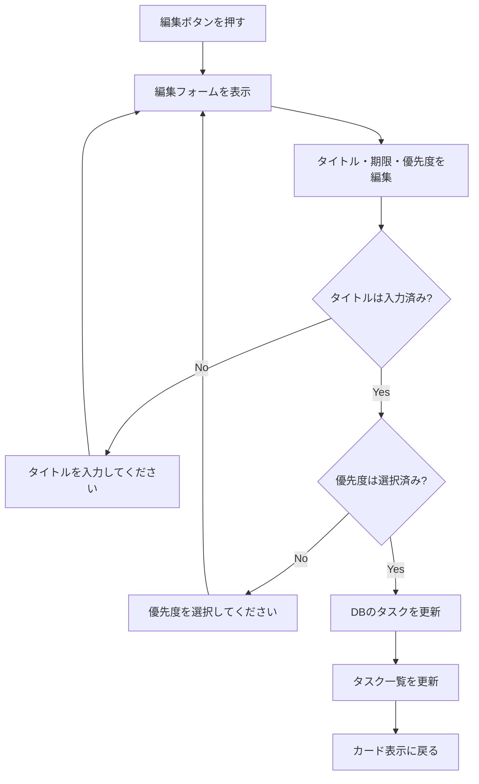
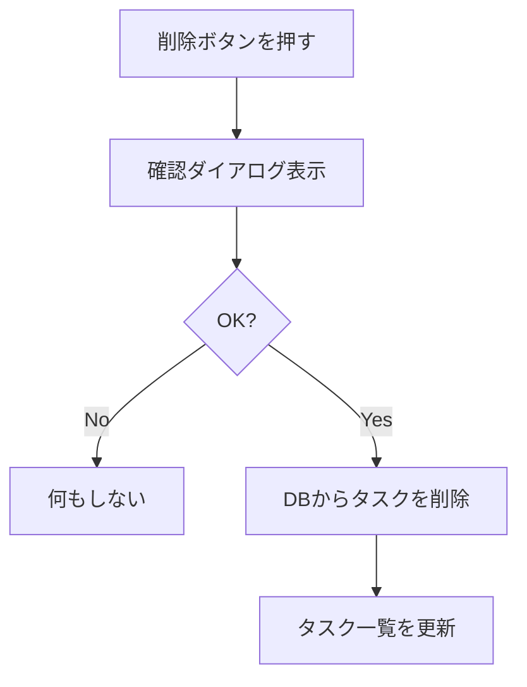
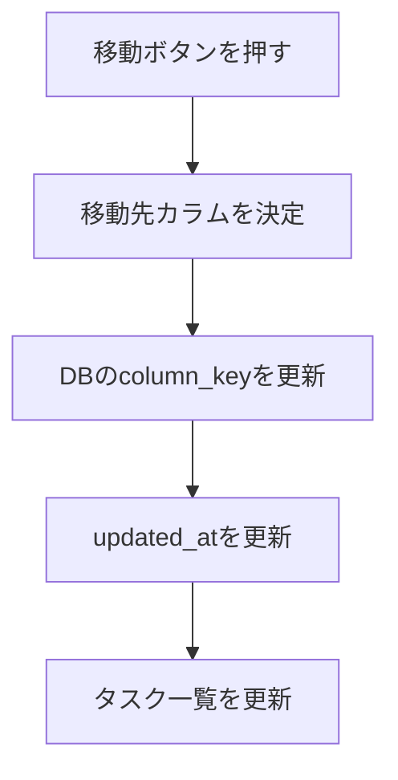
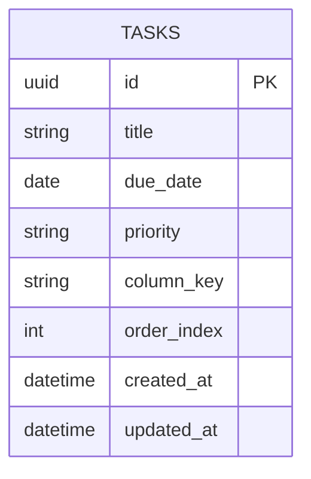

# Trello風タスク管理アプリ 基本設計書 v0.2

## 1. この資料の位置づけ

この資料は、Trello風タスク管理アプリの基本設計をまとめるものである。

画面に関する詳細は `screen-spec.md` に切り出す。
この資料では、主に以下を扱う。

- システム概要
- データ設計
- DB設計
- 操作フロー
- エラー設計
- 実装時の基本方針

## 2. システム概要

本アプリは、1つのタスクボード上でタスクを管理するWebアプリである。

ユーザーはタスクを以下の3状態で管理する。

```text
Todo / Doing / Done
```

データはDBに保存する。
MVPではログイン機能を持たず、単一ユーザー利用を前提とする。

DBテーブルは `tasks` の1テーブルのみとする。

## 3. 画面一覧

画面詳細は `screen-spec.md` を参照する。

| 画面ID | 画面名 | 概要 |
|---|---|---|
| SCR-001 | タスクボード画面 | タスク一覧、追加、編集、削除、移動を行う |

## 4. タスク状態遷移 Mermaid



許可する遷移は以下。

| From | To |
|---|---|
| Todo | Doing |
| Doing | Todo |
| Doing | Done |
| Done | Doing |

許可しない遷移は以下。

| From | To |
|---|---|
| Todo | Done |
| Done | Todo |

## 5. 操作フロー Mermaid

### 5.1 タスク追加フロー



### 5.2 タスク編集フロー



### 5.3 タスク削除フロー



### 5.4 タスク移動フロー



## 6. ER図 Mermaid

今回は `tasks` テーブル1つのみとする。



## 7. tasks テーブル定義

| カラム名 | 型 | 必須 | 内容 |
|---|---|---:|---|
| id | uuid | 必須 | タスクID |
| title | text | 必須 | タスク名 |
| due_date | date | 任意 | 期限日 |
| priority | text | 必須 | low / normal / high / urgent |
| column_key | text | 必須 | todo / doing / done |
| order_index | integer | 必須 | カラム内の表示順 |
| created_at | timestamp with time zone | 必須 | 作成日時 |
| updated_at | timestamp with time zone | 必須 | 更新日時 |

## 8. DB作成SQL

Supabase SQL Editorで以下を実行する。

```sql
create table tasks (
  id uuid primary key default gen_random_uuid(),
  title text not null,
  due_date date,
  priority text not null check (priority in ('low', 'normal', 'high', 'urgent')),
  column_key text not null check (column_key in ('todo', 'doing', 'done')),
  order_index integer not null default 0,
  created_at timestamp with time zone not null default now(),
  updated_at timestamp with time zone not null default now()
);
```

## 9. 初期データ投入SQL

```sql
insert into tasks (title, due_date, priority, column_key, order_index)
values
  ('Trello風アプリのMVPを作る', null, 'normal', 'todo', 1),
  ('要件を整理する', null, 'high', 'doing', 1),
  ('開発環境を準備する', null, 'normal', 'done', 1);
```

## 10. 固定カラム定義

カラムはDBではなく、アプリ側の固定値として定義する。

```ts
export const COLUMNS = [
  { key: "todo", title: "Todo" },
  { key: "doing", title: "Doing" },
  { key: "done", title: "Done" },
] as const;
```

## 11. 優先度定義

| 表示名 | DB値 |
|---|---|
| 低 | low |
| 通常 | normal |
| 高 | high |
| 緊急 | urgent |

## 12. エラー表示設計

| ケース | 表示メッセージ |
|---|---|
| タイトル未入力 | タイトルを入力してください |
| 優先度未選択 | 優先度を選択してください |
| DB取得失敗 | データの取得に失敗しました |
| DB保存失敗 | 保存に失敗しました |
| DB更新失敗 | 更新に失敗しました |
| DB削除失敗 | 削除に失敗しました |
