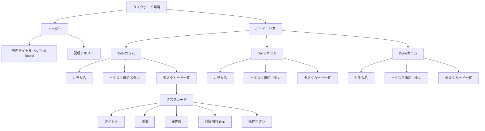
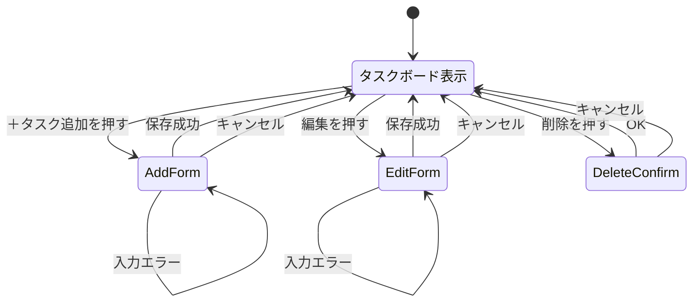
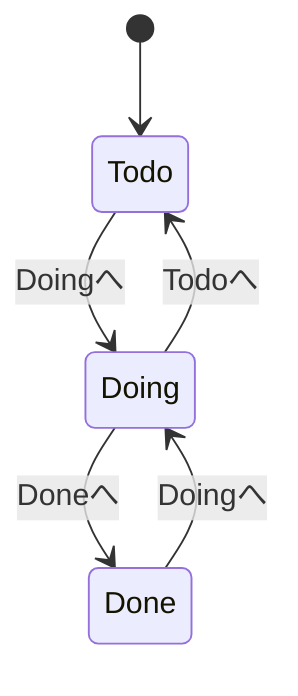

# Trello風タスク管理アプリ 画面仕様書 v0.1

## 1. この資料の目的

この資料は、Trello風タスク管理アプリの画面イメージを作成するための画面仕様書である。

まずはアプリ本体の実装ではなく、HTML/CSSのみで静的な画面イメージを作成する。
React、Next.js、Supabase、DB接続、JavaScriptによる動的処理はこの段階では実装しない。

## 2. 対象画面

| 画面ID | 画面名 | 内容 |
|---|---|---|
| SCR-001 | タスクボード画面 | Todo / Doing / Done の3カラムでタスクを表示する画面 |

## 3. 画面方針

- PC表示を前提とする
- MVPなので過度に作り込まない
- ただし、Trello風であることが分かる見た目にする
- 3カラム横並びのボード形式にする
- UI表示は日本語中心にする
- 画面タイトルは `My Task Board` とする
- 期限切れや優先度は、色だけでなくテキストでも分かるようにする

## 4. 画面構成 Mermaid



## 5. 画面レイアウト

```text
+------------------------------------------------------------------+
| My Task Board                                                    |
| 今日やること、進行中のこと、完了したことを整理しましょう。       |
+------------------------------------------------------------------+

+----------------------+----------------------+----------------------+
| Todo                 | Doing                | Done                 |
| + タスク追加          | + タスク追加          | + タスク追加          |
|                      |                      |                      |
| [カード]              | [カード]              | [カード]              |
| タイトル              | タイトル              | タイトル              |
| 期限                  | 期限                  | 期限                  |
| 優先度                | 優先度                | 優先度                |
| 期限切れ              | 期限切れ              |                      |
| 編集 削除 Doingへ     | 編集 削除 Todoへ Doneへ| 編集 削除 Doingへ     |
+----------------------+----------------------+----------------------+
```

## 6. 表示項目

### 6.1 ヘッダー

| 項目 | 表示内容 |
|---|---|
| 画面タイトル | My Task Board |
| 説明文 | 今日やること、進行中のこと、完了したことを整理しましょう。 |

### 6.2 カラム

| カラム名 | 表示内容 |
|---|---|
| Todo | 未着手タスク |
| Doing | 進行中タスク |
| Done | 完了済みタスク |

各カラムには以下を表示する。

- カラム名
- タスク件数
- `＋タスク追加` ボタン
- タスクカード一覧

### 6.3 タスクカード

各タスクカードには以下を表示する。

| 項目 | 内容 |
|---|---|
| タイトル | タスク名 |
| 期限 | 日付 |
| 優先度 | 低 / 通常 / 高 / 緊急 |
| 期限切れ | 条件に合う場合のみ表示 |
| 操作ボタン | 編集、削除、移動 |

## 7. サンプル表示データ

HTML/CSSの画面イメージでは、以下の固定サンプルを表示する。

### Todo

| タイトル | 期限 | 優先度 | 表示 |
|---|---|---|---|
| Trello風アプリのMVPを作る | 2026-06-20 | 通常 | - |
| Supabaseのテーブルを確認する | 2026-06-10 | 高 | 期限切れ |

### Doing

| タイトル | 期限 | 優先度 | 表示 |
|---|---|---|---|
| 要件を整理する | 2026-06-12 | 高 | 期限切れ |
| 画面仕様書を作る | 2026-06-15 | 通常 | - |

### Done

| タイトル | 期限 | 優先度 | 表示 |
|---|---|---|---|
| 開発環境を準備する | 2026-06-01 | 通常 | 期限切れ表示しない |

## 8. 追加フォームの画面イメージ

HTML/CSSの静的画面では、Todoカラム内に追加フォームのサンプルを1つ表示してよい。

```text
+----------------------+
| タイトル [        ]  |
| 期限     [yyyy-mm-dd]|
| 優先度   [選択]      |
| [保存] [キャンセル] |
| メッセージ表示欄     |
+----------------------+
```

入力項目:

- タイトル
- 期限
- 優先度

表示するボタン:

- 保存
- キャンセル

エラーメッセージ例:

```text
タイトルを入力してください
```

## 9. 編集フォームの画面イメージ

HTML/CSSの静的画面では、Doingカラム内に編集フォーム状態のカードを1つ表示してよい。

```text
+----------------------+
| タイトル [既存値]    |
| 期限     [既存値]    |
| 優先度   [既存値]    |
| [保存] [キャンセル] |
+----------------------+
```

## 10. 画面内状態遷移 Mermaid



## 11. タスク状態遷移 Mermaid



## 12. 色・見た目の方針

厳密なデザイン指定はしないが、以下を満たすこと。

- 背景は薄いグレー系
- カラムは白または薄いグレーのカード状
- タスクカードは白背景で影または枠線をつける
- 優先度はバッジ表示にする
- 期限切れは赤系のバッジまたはテキストで表示する
- ボタンは押せることが分かる見た目にする
- 余白を十分に取り、読みやすくする

## 13. 静的画面イメージ作成時の対象外

この段階では以下を実装しない。

- Reactコンポーネント化
- Next.jsページ実装
- Supabase接続
- DB取得
- タスク追加処理
- タスク編集処理
- タスク削除処理
- タスク移動処理
- フォームバリデーションの実処理
- GitHubへのpush

まずはHTML/CSSのみで、画面の完成イメージを確認できる状態にする。
